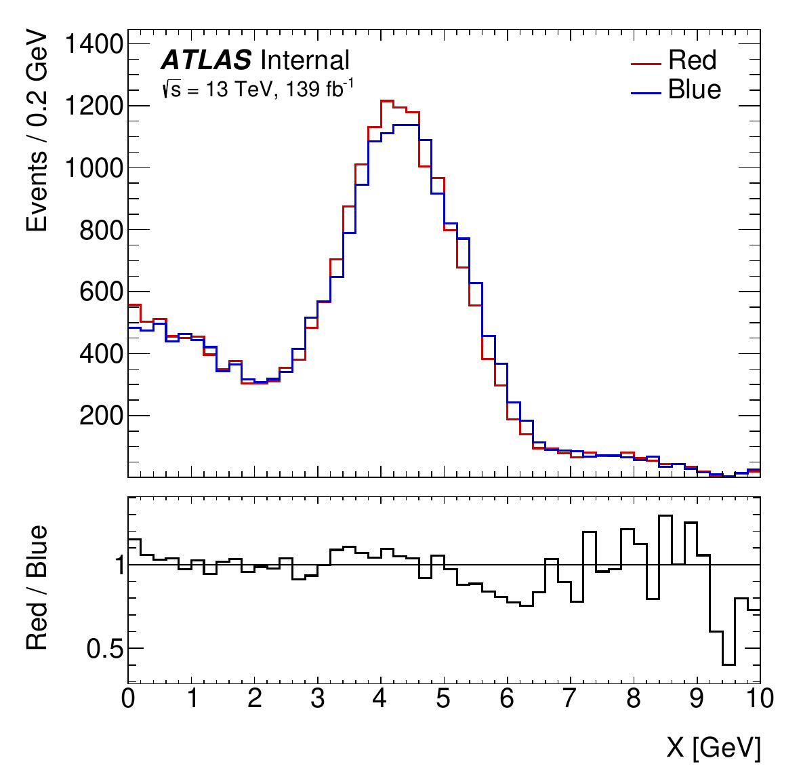
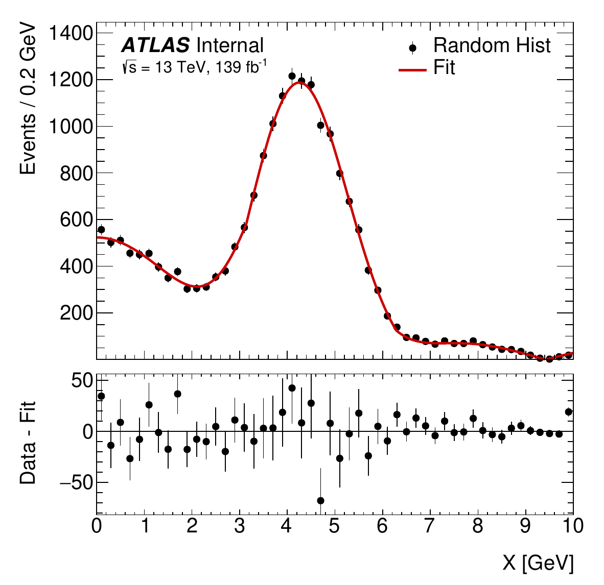

.. _examples:

Examples
========

*For those who learn by example*

------------

.. automodule:: examples.hist
    :members:

.. image:: _static/example_hist.png
   :align: center
   :alt: example_hist.png

------------

.. automodule:: examples.ratio
    :members:

------------

.. automodule:: examples.fit_and_resids
    :members:

------------

.. automodule:: examples.data_vs_mc
    :members:

.. image:: _static/example_data_vs_mc.png
   :align: center
   :alt: example_data_vs_mc.png