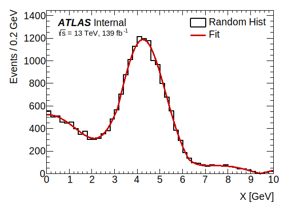
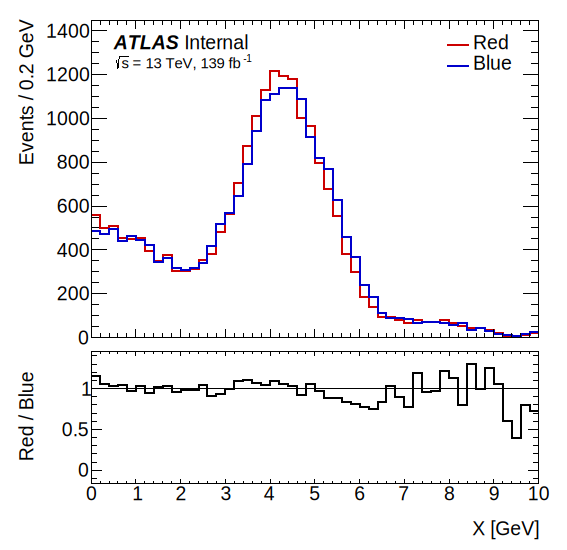
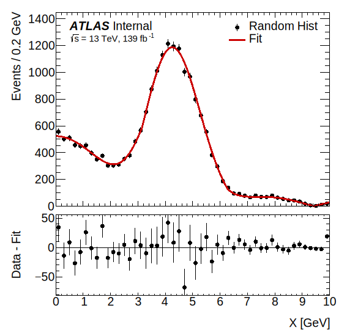
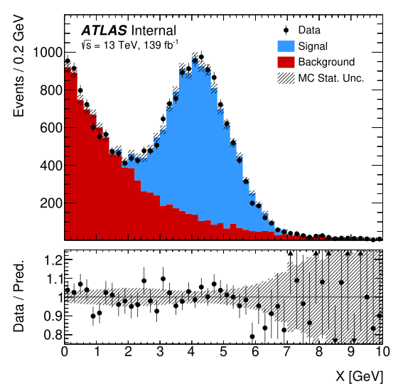
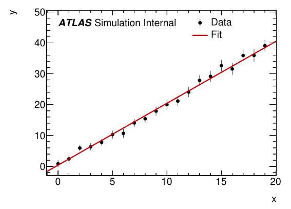
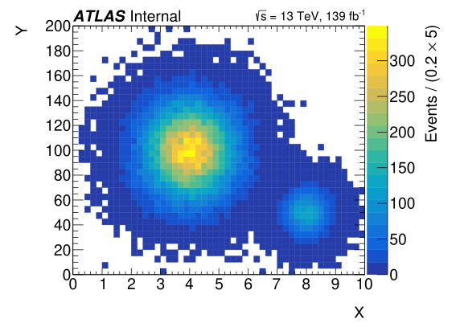

.. _examples:

Examples
========

*For those who learn by example*

------------

.. automodule:: examples.hist
    :members:

------------

.. automodule:: examples.ratio
    :members:

------------

.. automodule:: examples.fit_and_resids
    :members:

------------

.. automodule:: examples.data_vs_mc
    :members:

------------

.. automodule:: examples.numpy_graph
    :members:

------------

.. automodule:: examples.hist2D
    :members:

