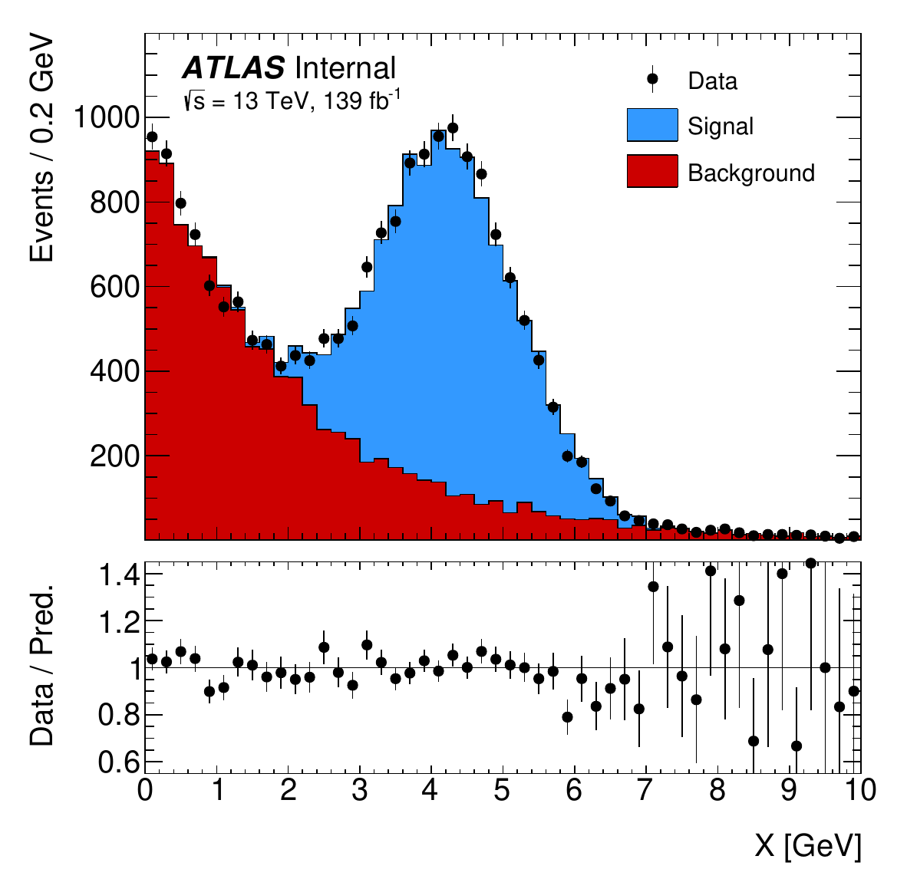

.. _examples:

Examples
========

*For those who learn by example*

------------

.. automodule:: examples.hist
    :members:

.. image:: _static/examples/hist.png
   :align: center
   :alt: hist.png

------------

.. automodule:: examples.ratio
    :members:

.. image:: _static/examples/ratio.png
   :align: center
   :alt: ratio.png

------------

.. automodule:: examples.fit_and_resids
    :members:

.. image:: _static/examples/fit_and_resids.png
    :align: center
    :alt: fit_and_resids.png

------------

.. automodule:: examples.data_vs_mc
    :members:

