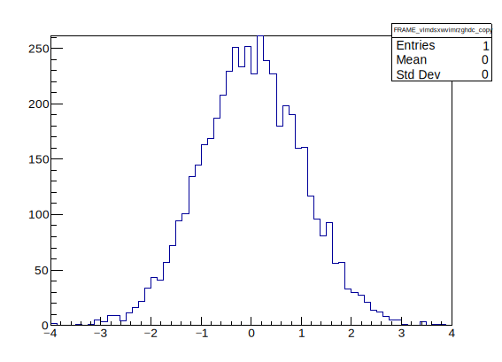
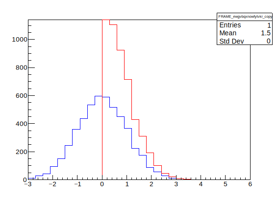

.. _user_guide:

User Guide
==========

This User Guide covers all of **atlasplots** by topic, from basic usage to its more advanced features.

If you prefer to learn by example, see the :ref:`examples` section.
Further information on any specific method can be obtained in the :ref:`api_reference`.

**Contents**

.. contents::
    :local:

Another Plotting Framework? *Why?*
----------------------------------

A young, impressionable student working in high-energy physics today has a plethora of plotting tools at their disposal to visualize their data.
While ROOT is the gold standard in high-energy physics data analysis, its plotting tools are notoriously cumbersome to use and require much "tweaking" to get your plots to look the way you want them to.
`matplotlib <https://matplotlib.org/>`_ is an attractive alternative for producing plots, thanks to its simple, intuitive syntax, and its ubiquitous usage in the Python community, but it is not always straightforward to use in existing ROOT-based analyses.
There are of course good reasons to use both these tools:

**Why use matplotlib**

- Industry standard for data visualization in the Python world.
- Huge community from a broad variety of disciplines.
- Simple syntax and easy to interface with many modern Python-based tools used in HEP.

**Why use ROOT (for plotting)**

- Common language for the HEP community.
- ROOT is really good at filling histograms (`TH1 <https://root.cern/doc/master/classTH1.html>`_ objects) from `TTrees <https://root.cern/doc/master/classTTree.html>`_.

  - ``TH1::Draw()`` is usually much simpler than looping over bins to convert to a matplotlib-readable format.
  - High-level functions are available to act on these objects in a way that a physicist expects, such as histogram fitting with ``TH1::Fit()``.

- Keep PubCom and your EB happy that your plots follow the ATLAS style.

**atlasplots** attempts to bridge this gap between matplotlib and ROOT, and is designed with two main goals in mind:

1. Interact with ROOT objects using `matplotlib <https://matplotlib.org/>`_-like syntax and idioms.
2. Produce plots following the standard `ATLAS <https://atlas.cern/>`_ style guidelines *with as little typing as possible*.

Who then should use **atlasplots**?

**atlasplots is for**:

- People who prefer working in Python but need to make plots using ROOT.
- People who prefer the matplotlib ethos of "plotting an object on an axis" rather than ROOT's "an object has an axis attribute".
- New ROOT users who find its graphics syntax cumbersome.

**atlasplots is NOT for**:

- People who like ROOT and don't want to use any external libraries.
- Seasoned ROOT pros who already have a working plotting framework.
- Senior research scientists who make their plots using graduate-student labour.

Importing **atlasplots**
------------------------

>>> import atlasplots as aplt

To enable the ATLAS style settings, use :func:`.set_atlas_style`:

>>> aplt.set_atlas_style()

It is not required for **atlasplots**, but you will usually need to import ``ROOT`` as well, e.g. to build the ROOT objects that you will plot. Since the module name ``ROOT`` does not conform to the `PEP8 standards for package and module names <https://www.python.org/dev/peps/pep-0008/#package-and-module-names>`_, it is recommended to instead import it as:

>>> import ROOT as root

A Simple Example
----------------

**atlasplots**, like matplotlib, plots your data on :class:`~.core.Figure`\s, each of which can contain one or more :class:`~.core.Axes` (i.e., an area where points can be specified in terms of *x-y* coordinates (or *theta-r* in a polar plot, or *x-y-z* in a 3D plot, etc.).
The simplest way of creating a figure with axes is using :func:`atlasplots.subplots() <.subplots>`.
We can then use :meth:`Axes.plot() <.core.Axes.plot>` to draw some data on the axes:

>>> hist = root.TH1F("hist", "", 64, -4, 4)  # Create a histogram
>>> hist.FillRandom("gaus")                  # Randomly fill it with a gaussian distribution
>>> fig, ax = aplt.subplots()                # Create a figure containing a single axes
>>> ax.plot(hist)                            # Plot the histogram on these axes

Don't worry that the statistics box says "Entries 1" since we will not normally display this box.
It is due to what an :class:`~.core.Axes` object is under the hood, which is explained below.

Figures and Axes
----------------

A :class:`~.core.Figure` object is a wrapper around a ROOT `TCanvas <https://root.cern.ch/doc/master/classTCanvas.html>`_, which can be accessed directly using :attr:`Figure.canvas <.core.Figure.canvas>`.
You can create an empty figure using :func:`atlasplots.figure() <.figure>`:

>>> fig = aplt.figure()
>>> fig.canvas
<cppyy.gbl.TCanvas object at 0x685ff90>

A :class:`~.core.Axes` object in **atlasplots** has no natural counterpart in ROOT, where axes objects are attributes of the object being plotted, such as a ``TH1``, ``TGraph``, ``TF1``, and so on.
With a ``TH1`` histogram object, for example, you would access its axes using ``TH1::GetXaxis()`` and ``TH1::GetYaxis()``, which return the ``TAxis`` objects for the *x* and *y* axes, respectively.
Instead, an :class:`~.core.Axes` object is a wrapper around a ROOT `TPad <https://root.cern.ch/doc/master/classTPad.html>`_ and a "frame", which is an empty ``TH1F`` histogram object drawn in the TPad.
:class:`~.core.Axes` provides matplotlib-like syntax to change axis parameters, like :meth:`~.core.Axes.set_xlim()` and :meth:`~.core.Axes.set_ylim()`, while still providing access to the underlying ROOT objects:

>>> fig, ax = aplt.subplots()
>>> ax.pad
<cppyy.gbl.TPad object at 0x6c694e0>
>>> ax.frame
<cppyy.gbl.TH1F object at 0x6e41640>

The ROOT model of plot axes makes it inherently difficult to plot multiple datasets on the same set of axes, since it is the data object itself that must keep track of its axes, rather than the axes keeping track of the data plotted on them.
To illustrate the problem, consider two histograms that span different ranges in *x* and *y*, plotted using plain PyROOT:

>>> h1 = root.TH1F("h1", "", 20, -3, 3)
>>> h1.SetLineColor(root.kBlue)
>>> h1.FillRandom("gaus")
>>> h2 = root.TH1F("h2", "", 20, 0, 6)
>>> h2.SetLineColor(root.kRed)
>>> h2.FillRandom("gaus")
>>> h1.Draw()
>>> h2.Draw("SAME")

.. image:: _static/userguide/figures_and_axes_01.svg
   :align: center

Why is ``h2`` not displayed in its entirety?
This is because ``h2.Draw("SAME")`` does not expand ``h1``'s axes to accommodate ``h2``.
The normal way to get around this issue is to do something like

>>> h1.SetMaximum(h2.GetMaximum())
>>> root.gPad.Modified()

This already feels quite clunky, and indeed the problem becomes more unwieldy as the number of datasets being plotted increases.
**atlasplots** solves this issue with the :class:`~.core.Axes` object.
Instead of calling ``TH1::Draw()`` directly to draw a ROOT object, the call to ``Draw()`` is delegated to :meth:`Axes.plot() <.core.Axes.plot>`, which automatically resizes the axes to accommodate the data being plotted, just as matplotlib does.
The example above reduces to:

>>> fig, ax = aplt.subplots()
>>> ax.plot(h1)
>>> ax.plot(h2)

Plot Formatting
---------------

There are two ways to change the appearance of a ROOT graphics object, such as its marker, line and fill attributes:

1. Directly modifying the ROOT object prior to the call to :meth:`Axes.plot() <.core.Axes.plot>`.
2. In the call to :meth:`Axes.plot() <.core.Axes.plot>` itself.

The first method is the traditional ROOT way of modifying graphics objects.
For example, to plot a histogram using a red line, do:

>>> hist = root.TH1F("hist", "", 64, -4, 4)
>>> hist.SetLineColor(root.kRed)
>>> hist.Draw()

With **atlasplots**, this can be done all at once:

>>> hist = root.TH1F("hist", "", 64, -4, 4)
>>> aplt.plot(hist, linecolor=root.kRed)

Consult the `Graphics attributes <https://root.cern.ch/doc/master/group__GraphicsAtt.html>`_ page in the ROOT documentation for the available attributes and options for the object you are plotting.
The `TAttMarker <https://root.cern.ch/doc/master/classTAttMarker.html>`_, `TAttLine <https://root.cern.ch/doc/master/classTAttLine.html>`_ and `TAttFill <https://root.cern.ch/doc/master/classTAttFill.html>`_ classes should cover most use cases for 2D plots.

The keyword argument syntax in :meth:`Axes.plot() <.core.Axes.plot>` is the same as the equivalent ROOT attribute setter function, but in all lower case and without the 'Set' prefix.
For example, to set the marker style, use ``markerstyle=...``, which calls ``SetMarkerStyle(...)``.
